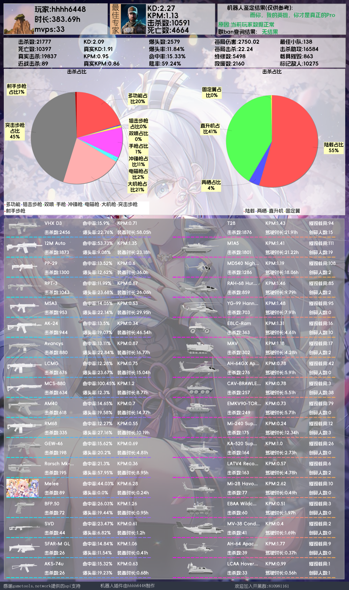
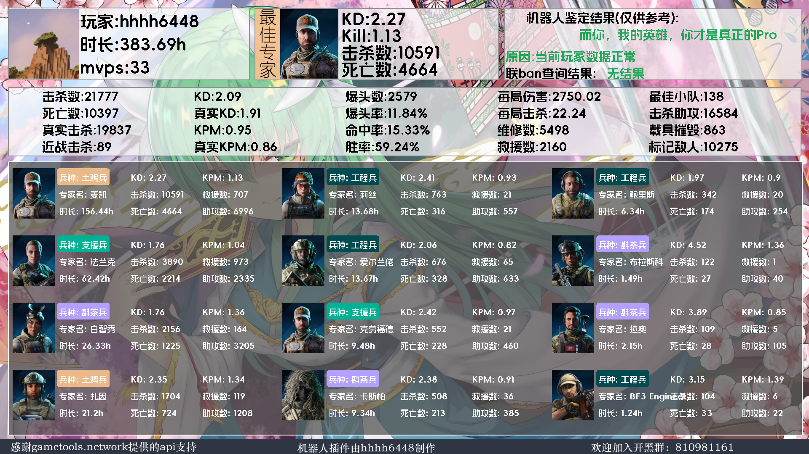
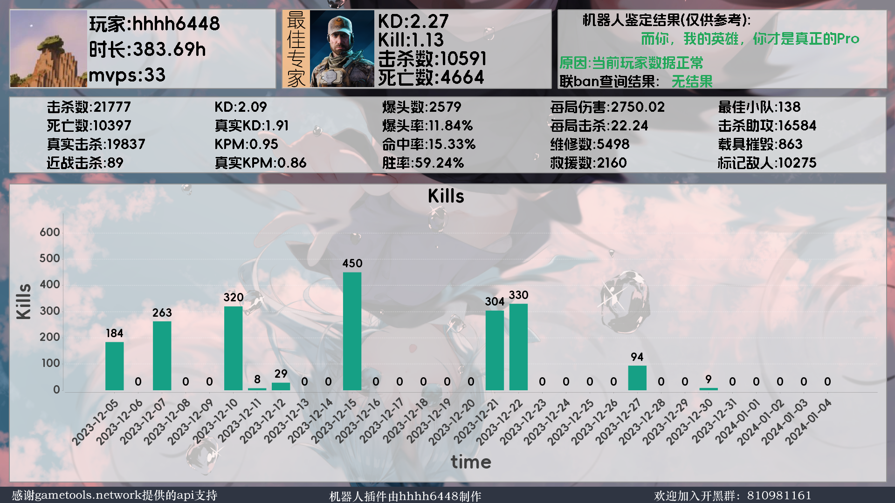
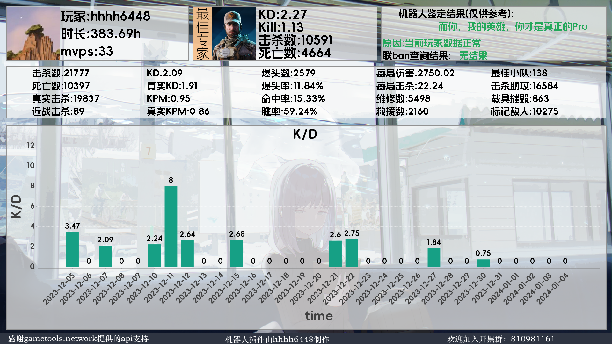

[img](https://socialify.git.ci/towenjian/BF2042StatsQQ/image?font=Source%20Code%20Pro&forks=1&language=1&name=1&owner=1&pattern=Circuit%20Board&stargazers=1&theme=Dark)
# 介绍
欢迎使用战地2042qq机器人，该插件是在[mirai](https://github.com/mamoe/mirai)的基础是开发的，
目的是方便查询玩家数据
**如果你使用该机器人，那么图片最下的信息你不可以抹除，否则请不要使用该机器人插件**

**感谢gametools.network提供的api支持**

# 更新日志
1.**添加了图形配置界面仅windows，所以部分linux系统可能无法使用**

2.**添加了热读取功能，配置文件更改后无需重启机器人即可生效**

3.**对于gametools的api出现问题添加了前置查询，因为gametools.network的查询页面依然能够正常工作（对于大部分玩家）
，通过对这个页面的研究而发现的，所以对于大部分玩家能够查询到数据**
建议是在api恢复正常的时候关闭这个选项以提高查询速度

# 使用方法
## 加载方法
下载插件后将插件放到mirai的plugin文件夹里面运行一遍即可，运行后会在config文件夹里面生成配置文件
夹，由于本人对Java也是刚刚入门，所以对于mirai的配置文件生成不太熟悉，自己写了应该简单的配置读取，
支持热读取。下面是配置文件详情

**请尽量记住初始配置文件作用，因为更新配置文件夹会导致注释消失，或者你备份一份也行**

    qqGroup:
      - '111'
      - '1111'
      - '11'
      - '11'
        user: '111111'
        qqBot: 222
        openWelcome: true #入群欢迎开关
        welcome: "" #入群欢迎
        menuMessage: "   小助手菜单\n可用的功能有：\n-1.2042战绩查询，前缀为#cx\n-2.2042武器数据图输出，前缀为#wp\n-3.2042载具数据图输出，前缀为#vh\n-4.2042专家数据图输出，前缀为#cl\n-5.数据绑定#bd id 平台，都为必填参数\n---对于除绑定外的指令结构都为type id 平台（不填默认为pc）
        其中type为每个指令的前缀\n---对于绑定后的玩家只需要输入前缀即可，既#cx等等，绑定后机器人会自动填入你之前的值" #菜单选项
        openRequestValidation: false #对于是否开启入群验证，入群自动验证
        RequestIssue: ""#填写你的入群问题，负责无法正确验证
        tempPlayer: 10 #临时玩家允许的数量，请不要设置太多
        preGet: false #该选项作用与查询前的准备，用于适应api抽风的情况，如果api无法正常获取并且id无法被搜索请打开此选项试试
        PrivateChatSearch: false #是否允许私聊信息
        cx: true
        cl: true
        vh: true
        wp: true
        kd: true
        kill: true
## 数据文件夹
在除了配置文件夹的配置后，还需要到数据文件夹下放入3个文件夹，分别是

1.cl

2.veh

3.wp

如果data文件夹里面没有com.BF2042Stats.v1文件夹的需要自行创建

这三个文件夹的作用是让机器人在本地拉取武器、专家和载具的数据，减少网络拉取的时间，加快速度，并且对于
在文件夹里面没有但是json里面含有图片链接的情况，机器人会自行下载图片放到对应的文件夹里面，无需自己添加
# 指令介绍
指令的前缀都是#号，指令结构大都为type id 平台（平台不填即为pc端），除了绑定指令

**这些指令都需要加入#作为前缀，否则机器人不会反应**

-cx
基本的查询指令，输出基本数据和数据图，数据图较为大，可能会等待片刻

-cl 查询玩家专家的数据指令

[//]: # (![test]&#40;https://moe.jitsu.top/img/?sort=mp&size=mw1920&#41;)

-wp 查询玩家武器的数据指令
懒得放了

-vh 查询玩家载具的数据指令

-bd **注意**该指令是用于将玩家id与qq号进行绑定的指令，绑定后只需要输入指令前缀即可，既#cx和#cl之类的，方便快速查看自己的数据

-list **注意**该指令仅适用与管理员（指配置文件里面的user）。用于查看缓存的玩家数量

-cd 菜单指令

-kill 获取玩家每日的击杀情况，将会已条状图的方式显示出来

-kd 获取玩家每日的kd变化，显示同上

# 机器人对于玩家数据的处理
对于绑定的玩家的数据，机器人会对于该数据进行应该时长为24小时的缓存，在缓存期间会每隔一小时自动更新数据，这个方法极大的优化了对于玩家数据的响应，
并且缓存数量是没有限制的。

对于没有绑定的玩家的数据，只会缓存2个小时，到期后会自动删除
# 待增加的功能

1.玩家申请入群的验证，自动查询玩家数据（已完成）

2.想到了在做。。。
